# Tier-Ratespiel: Entdecke die Nationaltiere der Welt 🌍

Ein interaktives Lernspiel für Kinder, entwickelt als Semesterprojekt im Kurs "Programmiersprachen 3" an der HfG Schwäbisch Gmünd.

## 📸 Screenshots & Impressionen


_Willkommensseite mit den verschiedenen Spielmodi_

<div style="display: flex; gap: 10px; margin-bottom: 20px;">
    <div>
        
        *Puzzle-Modus mit aufgedeckten Kacheln*
    </div>
    <div>
        
        *Wordle-Modus mit Tier-Auswahl*
    </div>
</div>

## 🔄 Flowchart & Wireframes

### Spielablauf


### Systemarchitektur


### Benutzerinteraktion


### Komponenten-Hierarchie

- 🏠 App Root
  - 📱 Layout
    - 🎮 Game Container
      - 🧩 Puzzle Mode
        - 🖼️ Image Grid
        - ⌨️ Input Field
        - 🎯 Progress Display
      - 📝 Wordle Mode
        - 🎲 Animal Selection
        - 🚩 Flag Display
        - ✨ Success Animation
    - 📊 Highscore Board
    - ⚙️ Settings Panel

### Datenfluss

- 📥 Input Layer

  - Benutzer-Interaktionen
  - API-Responses
  - Local Storage

- 🔄 Processing Layer

  - State Management
  - Game Logic
  - Validation

- 📤 Output Layer
  - UI Updates
  - Feedback System
  - Score Tracking

## 📁 Projektarchitektur & Technischer Stack

**Frontend**: SvelteKit mit TypeScript  
**Styling**: CSS mit Jungle-Theme  
**APIs**:

- Unsplash API für dynamische Tierbilder
- Wikipedia API für Tier-Informationen
- FlagCDN für Länderflaggen

**Bibliotheken**:

- `canvas-confetti` für Erfolgs-Animationen
- `axios` für HTTP-Anfragen
- `dotenv` für Umgebungsvariablen
- `svelte/store` für State Management

### 🎨 Farbpalette & Theming

```css
--jungle-primary: #2e7d32 /* Hauptfarbe für wichtige Elemente */ --jungle-secondary: #4caf50
	/* Sekundärfarbe für Akzente */ --jungle-light: #81c784 /* Helle Variante für Hintergründe */
	--jungle-dark: #1b5e20 /* Dunkle Variante für Kontraste */ --jungle-accent: #ffd700
	/* Goldakzente für Erfolge */ --jungle-text: #2c3e50 /* Haupttextfarbe */
	--jungle-shadow: rgba(0, 0, 0, 0.2) /* Schatten für Tiefeneffekt */;
```

### 🔧 Technische Besonderheiten

- **TypeScript Integration**: Vollständige Typisierung für bessere Entwicklererfahrung
- **API-Fehlerbehandlung**: Mehrstufiges Fallback-System
  1. Deutsche Wikipedia API
  2. Englische Wikipedia API
  3. Unsplash API
  4. Lokale Fallback-Bilder
- **Responsive Design**: Mobile-First Ansatz mit CSS Grid und Flexbox
- **State Management**: Svelte Stores für reaktive Datenverwaltung
- **Performance Optimierung**:
  - Lazy Loading für Bilder
  - Debounced API-Calls
  - Lokales Caching von Highscores

### 📂 Projektstruktur

```
├── src/
│   ├── components/
│   │   ├── PuzzleGrid.svelte    # 3x3 Grid-System
│   │   └── WordleMode.svelte    # Barrierefreie Klick-Interface
│   │
│   ├── lib/
│   │   ├── animalList.ts        # Nationaltiere und heraldische Tiere
│   │   ├── countryUtils.js      # Länder-Mapping
│   │   ├── highscoreStore.js    # Lokale Speicherung
│   │   ├── unsplash.js         # Bildintegration
│   │   └── wikipedia.js        # Tier-Informationen
│   │
│   ├── routes/
│   │   ├── game/
│   │   │   ├── puzzle/+page.svelte   # Puzzle-Modus
│   │   │   └── wordle/+page.svelte   # Wordle-Modus
│   │   │
│   │   ├── highscores/+page.svelte   # Bestenliste
│   │   └── +page.svelte             # Startseite
│   │
│   ├── app.css                      # Globale Styles
│   └── app.html                     # HTML-Template
│
└── static/                          # Statische Assets
    └── animals/                     # Fallback-Tierbilder
```

## 🎨 Design-System

### Schriftgrößen und Hierarchie

#### Überschriften

- **H1 (2.4rem)**: Hauptüberschriften der Seiten
- **H2 (1.8rem)**: Wichtige Sektionsüberschriften
- **H3 (1.8rem)**: Unterabschnitte und Komponententitel

#### Textkörper

- **Normaler Text (1.4rem)**: Hauptinhalt, Beschreibungen, Spielanweisungen
- **Info-Text (1.2rem)**: Zusätzliche Informationen, Hinweise

### Einheitliches Wording

- "Tier-Abenteuer" als Hauptbegriff
- "Entdecker" für die Spieler
- "Puzzle-Modus" und "Wordle-Modus" als Spielmodi
- Konsistente Button-Beschriftungen
- Einheitliche Feedback-Nachrichten
- Durchgängige Verwendung passender Emojis

## ✨ Kernfunktionen

### 🧩 Puzzle-Modus

- Progressives Aufdecken von 9 Bildkacheln
- Dynamische Unsplash-Integration
- Fehlertolerante Eingabe

### 🎯 Wordle-Modus

- 14 auswählbare Nationaltiere
- Highscore-System
- Konfetti-Animation bei Erfolg

### 👶 Kindgerechte Umsetzung

#### Benutzeroberfläche

- **Große, zugängliche Schaltflächen**: Mindestgröße von 150px für einfache Bedienung
- **Klares Feedback-System**: Direkte und verständliche Rückmeldungen
- **Countdown vor Spielbeginn**: Sanfter Einstieg ins Spiel
- **Progressive Schwierigkeitsgrade**: Anpassung an verschiedene Fähigkeitsstufen

#### Visuelles Design

- **Jungle-Theme**: Kindgerechtes Dschungel-Thema mit harmonischen Grüntönen
- **Responsives Grid-Layout**: Optimale Darstellung auf allen Geräten
- **Konsistente Hover-Effekte**: Klare visuelle Rückmeldungen
- **Harmonische Farbpalette**: Durchdachte Farbkombinationen

#### Bildungselemente

- **Länderflaggen**: Spielerisches Lernen von Nationalitäten
- **Wikipedia-Wissen**: Altersgerechte Tierinformationen
- **Sprachförderung**: Synonymerkennung und Wortschatzerweiterung
- **Kultureller Kontext**: Vermittlung von Wissen über Nationaltiere

#### Technische Optimierungen für Kinder

- **Fehlertolerante Eingabe**: Erkennung ähnlicher Begriffe
- **Offline-Funktionalität**: Lokale Fallbacks für stabiles Spielerlebnis
- **Schnelle Ladezeiten**: Optimierte Bilder und Lazy Loading
- **Benutzerfreundliche Fehlermeldungen**: Klare Hinweise bei Problemen

### API-Einschränkungen und Rate Limits

- **Unsplash API Rate Limits**:
  - 50 Anfragen pro Stunde
  - Automatische Warnung bei Erreichen der Limits
  - Fallback auf lokale Bilder

## 🚀 Installation & Setup

### Voraussetzungen

- Node.js (v16 oder höher)
- npm oder yarn

### Installation

```bash
# Repository klonen
git clone https://github.com/charaschoe/embleem.git
cd embleem

# Abhängigkeiten installieren
npm install

# Entwicklungsserver starten
npm run dev
```

### ⚙️ Konfiguration

Erstelle eine `.env`-Datei im Hauptverzeichnis:

```env
# API Keys
VITE_UNSPLASH_ACCESS_KEY=dein_unsplash_key
VITE_WIKIPEDIA_USER_AGENT=embleem/1.0

# Entwicklungseinstellungen
VITE_DEV_MODE=true
VITE_API_TIMEOUT=8000
```

## 📜 Projektkontext

Entwickelt im Wintersemester 2023/24 bei Prof. Fabian Rauch ([@caitoor](https://github.com/caitoor)) an der HfG Schwäbisch Gmünd. Zielgruppe: Kinder von 6-8 Jahren.

## 🌐 Roadmap

- [ ] Mehrsprachiger Support
- [ ] Mobile-Modus / Standalone App
- [ ] Tierdatenbank-Erweiterung
- [ ] Multiplayer-Funktionen

## 🙏 Danksagungen

- Unsplash für Tierbilder
- FlagCDN für Flaggen
- HfG Gmünd für Infrastruktur

**Lizenz**: MIT  
**Kontakt**: [Jonas Wienberg](mailto:jonas.wienberg@hfg-gmuend.de)  
GitHub: [@charaschoe]

---

Entwickelt mit ❤️ an der HfG Schwäbisch Gmünd

## 🔄 Entwicklungsprozess & Herausforderungen

### Initiale Planung & Prototyping

```mermaid
graph TD
    A[Erste Idee: Tier-Quiz] -->|Iteration 1| B[Einfaches Quiz]
    B -->|Problem| C[Zu wenig Interaktion]
    C -->|Lösung| D[Puzzle-Mechanik]

    D -->|Challenge| E[Bildqualität Unsplash]
    E -->|Problem| F[Unpassende Tierbilder]
    F -->|Lösung| G[Eigene Bildauswahl + Fallback]

    H[Wordle-Inspiration] -->|Integration| I[Dual-Mode Konzept]
    I -->|Challenge| J[Komplexität für Kinder]
    J -->|Lösung| K[Vereinfachte UI]
```



### Technische Herausforderungen

#### API-Integration Probleme

- ❌ Unsplash API Rate Limits erreicht während Testing
- ❌ Wikipedia API lieferte zu komplexe Texte
- ✅ Lösung: Mehrstufiges Fallback-System & Text-Vereinfachung

#### Performance-Probleme

- ❌ Lange Ladezeiten bei Bildern
- ❌ UI-Verzögerungen bei API-Calls
- ✅ Lösung: Lazy Loading & Optimierte Caching-Strategie

#### Kindgerechte Anpassungen

- ❌ Erste Version zu komplex
- ❌ Text-Eingabe frustrierend
- ✅ Lösung: Vereinfachte UI & Fehlertolerante Eingabe

### Entwicklungsiterationen

1. **Prototype v0.1**

   - Basis-Quiz ohne Bilder
   - Simple Textabfrage
   - _Problem: Zu langweilig für Kinder_

2. **Alpha v0.2**

   - Integration von Unsplash
   - Erste Puzzle-Mechanik
   - _Problem: Performance-Einbrüche_

3. **Beta v0.3**

   - Dual-Mode System
   - Verbesserte Bildverwaltung
   - _Problem: Zu komplexe Bedienung_

4. **Release v1.0**
   - Kindgerechtes UI
   - Optimierte Performance
   - Fehlertolerantes System

### Gelernte Lektionen

1. **API-Management**

   - Frühzeitige Implementierung von Rate Limiting
   - Lokale Fallbacks sind essentiell
   - Caching reduziert API-Last

2. **Kindgerechtes Design**

   - Weniger ist mehr
   - Direktes Feedback wichtig
   - Frustration vermeiden

3. **Performance**

   - Bilder voroptimieren
   - API-Calls minimieren
   - Progressive Loading

4. **Testing**
   - Mit Zielgruppe testen
   - Edge Cases beachten
   - Offline-Funktionalität wichtig
